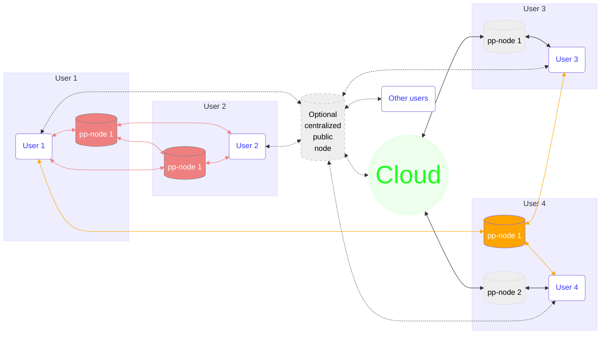
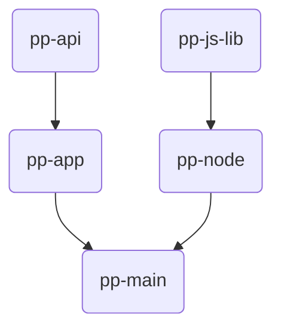

# pp-main
People post software assembling 

## Design
### Deployment view

### Repository dependencies

## Directory layout

| Name                         | Description                                   |
|------------------------------|-----------------------------------------------|
| personal/                    | Personal node packaging                       |

